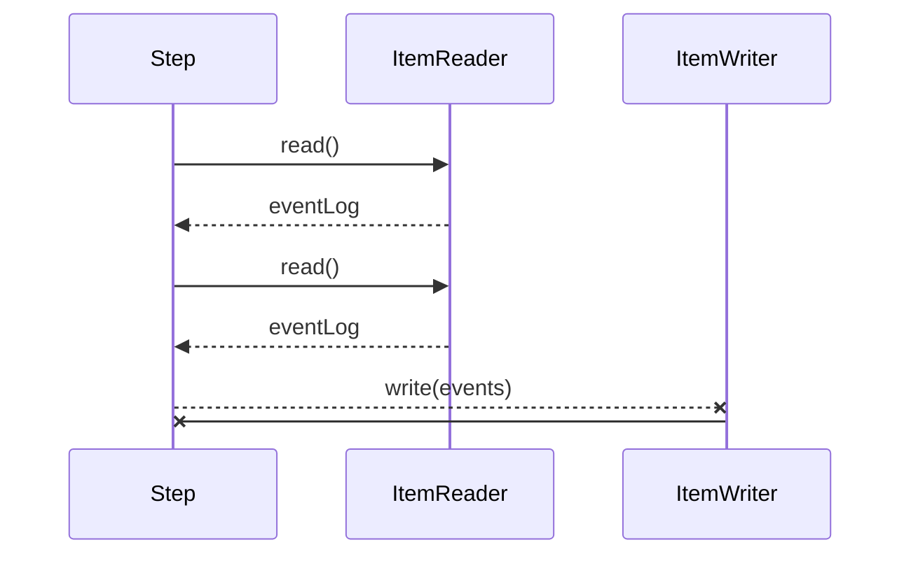

# Credit Suisse - Log Ingestion

## Overview

This application must read a file log and persist in a database hsqldb.

## Technologies

For this I built a Java project using Gradle and Spring Batch framework.
The application was designed using Clean Architecture (https://8thlight.com/blog/uncle-bob/2012/08/13/the-clean-architecture.html).
List of the technologies, frameworks and tools used:
- Java 8
- Spring Batch
- Spring Data
- Spring Test (for integration tests)
- Lombok

## Tests

The application has unit and accept tests.
Both are under the "/src/test" directory.

## Running the application

Go to root folder and type on your terminal:

> bash> gradle jar
> bash> cd  buildDir/libs
> bash> java -jar log-ingestion-0.0.1-SNAPSHOT.jar

**The application will ask for path to file.**

## UML diagram

Spring Batch uses a 'Chunk Oriented' processing style within its most common implementation.
